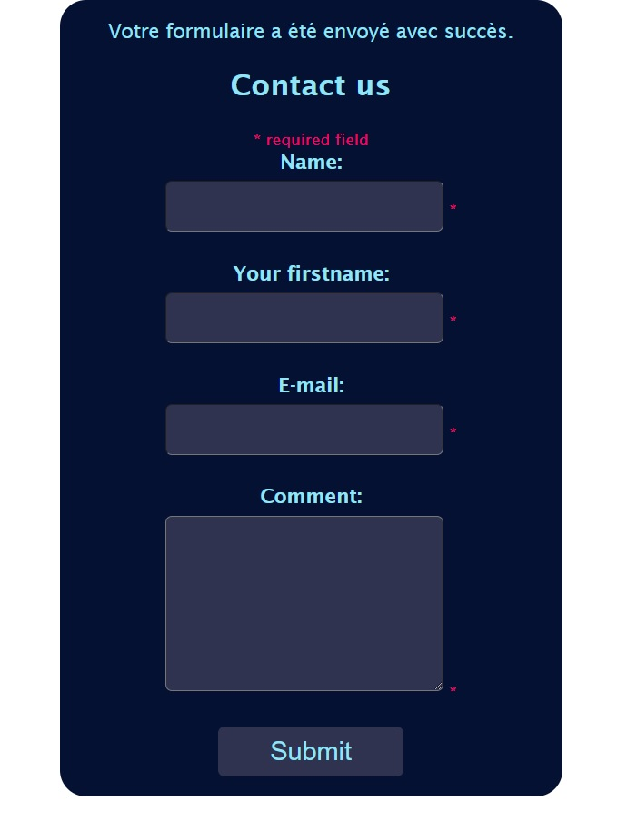

# hackers-poulette

## La mission  
La société Hackers Poulette™ vend des kits d'accessoires Raspberry Pi pour construire le vôtre. Ils veulent permettre à leurs utilisateurs de contacter leur équipe de support. Votre mission est de créer un formulaire de "contact support" en ligne entièrement fonctionnel, en PHP . Il doit afficher un formulaire de contact et traiter la réponse reçue (assainir, valider, répondre à l'utilisateur).

La forme
Au minimum, le formulaire doit inclure les champs suivants :

* Nom
obligatoire, chaîne, au moins 2 caractères, max 255

* Prénom
obligatoire, chaîne, au moins 2 caractères, max 255

* adresse e-mail
requis, au moins 2 caractères, max 255, doit être une adresse e-mail valide

* commenter
requis, au moins 250 caractères max, max 1000 caractères

## 🌱Fonctionnalités indispensables  
Utilisation de PHP
* Base de données avec connexion PDO
* Le code html du formulaire doit être sémantiquement valide et accessible
* En cas de saisie erronée, le formulaire doit afficher un indice visuel utile sur l'erreur, sous le champ de saisie.
* Le message d'erreur doit être lisible et utile aux utilisateurs.
* Les données doivent être aseptisées et validées (côté serveur)
* Une fois le formulaire validé, les données doivent être envoyées à la base de données.
* Prévention du spam à l'aide d' un pot de miel ou d'un captcha
---
## Rendu  

---
## lien serveur 
__Ne prend pas le localhost pour l'instant__

[Lien serveur](https://laura-wilhelmi.000webhostapp.com/)